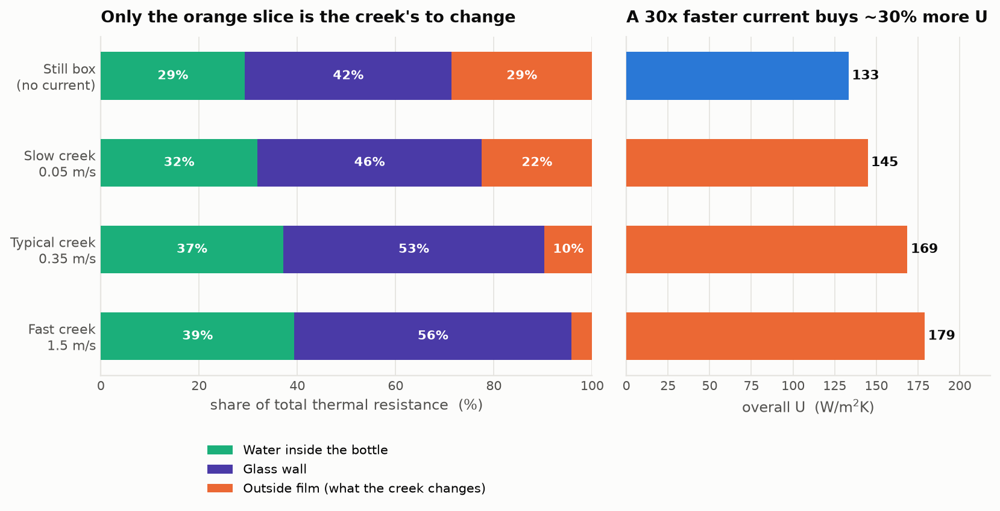
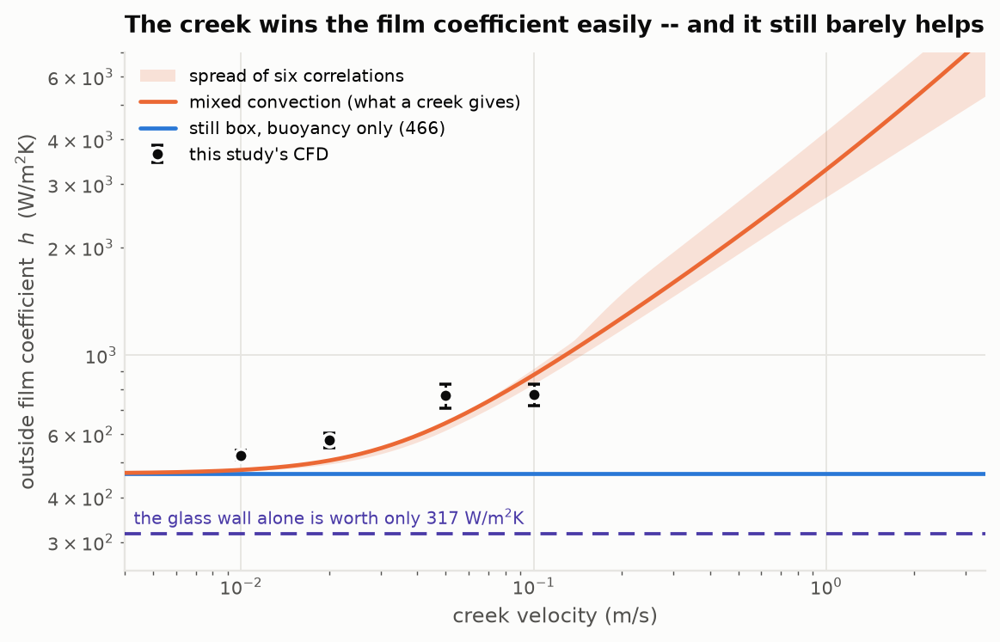
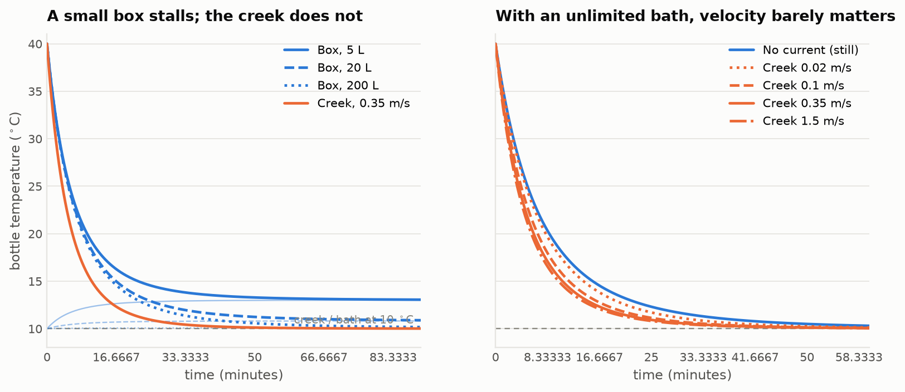
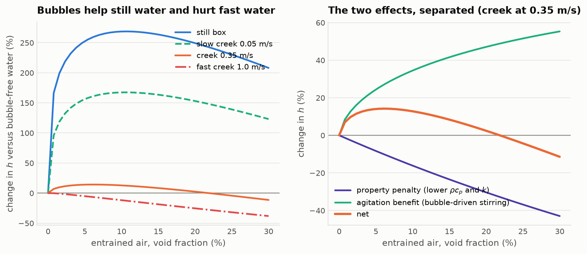
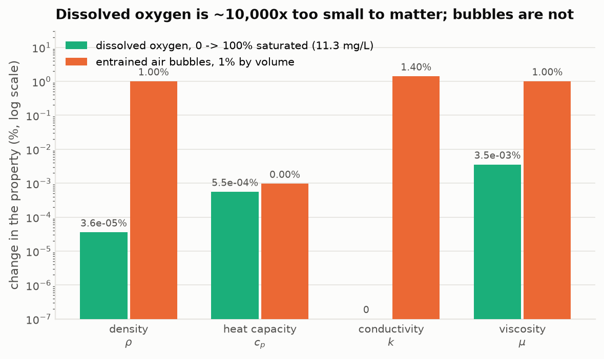
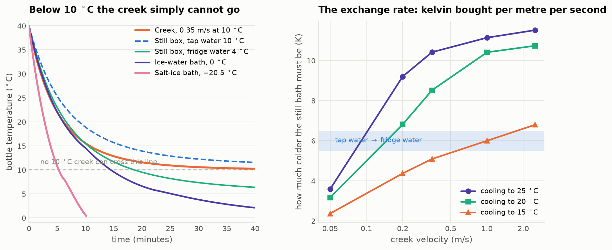
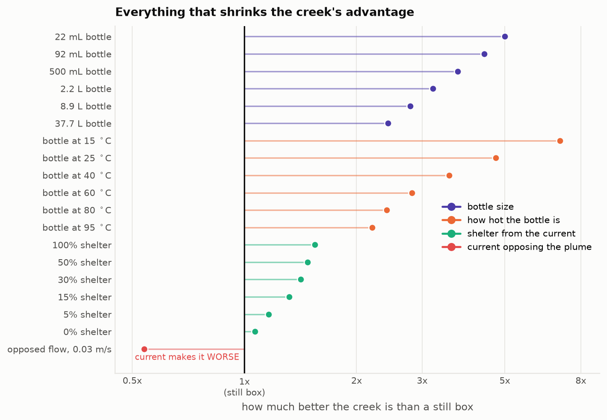
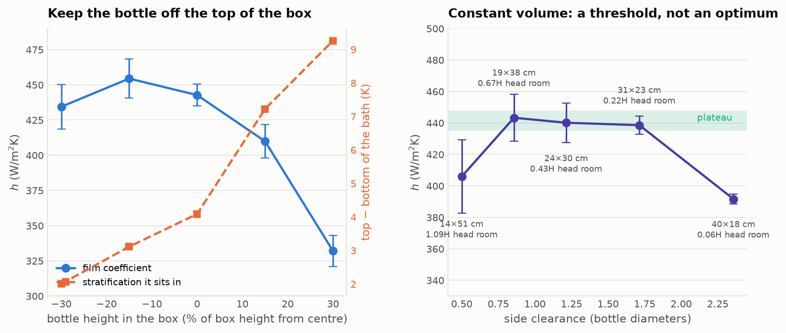
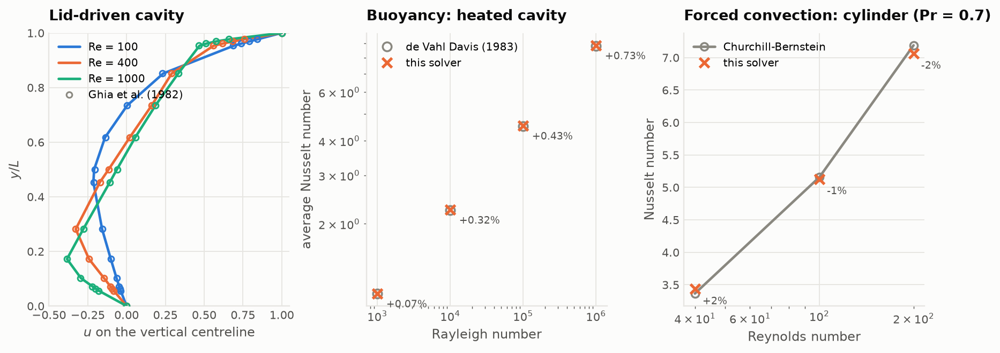
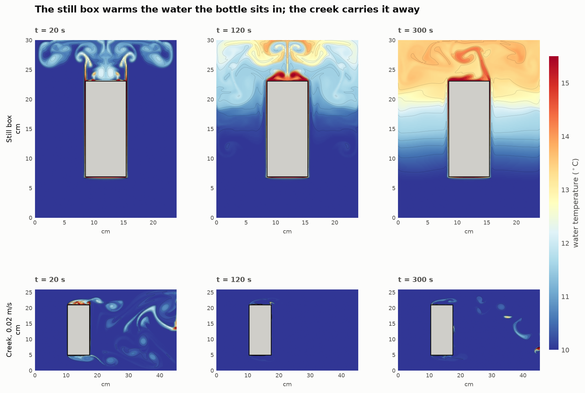

# Cooling a warm bottle: still box versus moving creek

A warm glass bottle of water is submerged in cold water two ways — in a box of
motionless water, and in a moving creek. Which cools faster, and why?

**Short answer: the creek, essentially always. But not for the reason the
question implies, and by much less than you would guess.**

The creek's advantage is not really about the creek being *faster*. Moving from
still water to a brisk 0.35 m/s current multiplies the outside film coefficient
by about 3.7 — and improves the actual cooling rate by only about 27 %, because
the outside film was never what was limiting. For a 3 mm glass bottle the wall
and the water inside it own 70–90 % of the resistance, and a current cannot
touch either. Most of what people attribute to "the creek is flowing" is really
"the creek is *infinite*": a box warms itself up as it absorbs heat, and a small
enough box simply never gets the job done at any stirring rate.

## Headline numbers

500 mL water in a 3 mm soda-lime glass bottle, 40 °C, dropped into 10 °C water:

| | → 25 °C | → 15 °C | → 12 °C | T at 30 min | settles at |
|---|---|---|---|---|---|
| Still box, 20 L | 5.2 min | 16.6 min | 32.8 min | 12.3 °C | 10.8 °C |
| Creek, 0.35 m/s | 3.7 min | 10.7 min | 17.9 min | 10.6 °C | 10.0 °C |
| Still box, 2 L | 5.9 min | **never** | **never** | 17.1 °C | 16.5 °C |
| Ice-water box, 0 °C | 3.8 min | 9.5 min | 12.3 min | 3.8 °C | 0.0 °C |

## Where the resistance actually sits



This is the whole explanation, and it is why the answer is less dramatic than
expected:

| | outside film h | inside | glass wall | outside | overall U |
|---|---|---|---|---|---|
| still box | 466 W/m²K | 29 % | 42 % | 29 % | 133 W/m²K |
| creek 0.05 m/s | 645 | 32 % | 46 % | 22 % | 145 |
| creek 0.35 m/s | 1741 | 37 % | 53 % | 10 % | 169 |
| creek 1.50 m/s | 4301 | 39 % | 56 % | 4 % | 179 |

Going from still water to a fast 1.5 m/s current multiplies the external film
coefficient by 9.2 and the overall U by 1.35. The 3 mm glass wall alone is worth an equivalent film
coefficient of only 317 W/m²K — less than *still* water already provides. Past
about 0.3 m/s the creek is pushing on a door that is already open.





## Things that matter more than whether the water is moving

Starting from the 20 L still box and changing exactly one thing:

| change | → 15 °C | speed-up |
|---|---|---|
| *(baseline still box)* | 16.6 min | 1.00× |
| swap glass for aluminium | 10.2 min | **1.63×** |
| use 4 °C water instead of 10 °C | 10.5 min | **1.59×** |
| move it to a 0.35 m/s creek | 10.7 min | 1.55× |
| bubble air through the box (1 % void) | 11.8 min | 1.41× |
| use a 250 mL bottle instead of 500 mL | 12.5 min | 1.33× |
| stir the box by hand (0.1 m/s) | 12.6 min | 1.32× |
| halve the wall thickness | 13.6 min | 1.22× |
| swap glass for PET | 36.2 min | 0.46× |

Swapping the container material beats finding a creek. So does six degrees of
bath temperature. So does stirring the box with your hand, which recovers 60 %
of the creek's entire advantage for free.

## On oxygenation

You asked specifically about aerated creek water versus still water. The phrase
bundles three different things, and they do not agree with each other:

1. **Dissolved oxygen: irrelevant.** A 10 °C creek at 100 % saturation holds
   11.3 mg/L — a mass fraction of 1.1 × 10⁻⁵. Going from zero to *twice*
   saturation changes the film coefficient by **−0.001 %**. The six standard
   forced-convection correlations disagree with each other by ±20 % on the same
   case, so dissolved oxygen is four orders of magnitude below the noise.
2. **Entrained bubbles hurt the properties.** Real bubbles displace water. At
   5 % void the mixture loses 5 % of its volumetric heat capacity and 7 % of its
   conductivity. Both are the wrong direction.
3. **Bubbles help by stirring.** Rising bubbles drag liquid with them at
   ~0.2 m/s. That is the entire benefit of aeration, and it is large — but only
   where there was no motion to begin with.





| net change in h | still box | creek 0.05 m/s | creek 0.35 m/s | creek 1.0 m/s |
|---|---|---|---|---|
| 1 % void | **+178 %** | +104 % | +8 % | −0.4 % |
| 30 % void | +207 % | +123 % | −11 % | **−38 %** |

So aeration is a large effect in the *box* and a negligible-to-harmful one in
the *creek*. It narrows the gap rather than widening it. Full treatment in
[docs/oxygenation.md](docs/oxygenation.md).

## A physical trap the still box cannot escape

Water's density maximum sits at 3.98 °C, so below that its thermal expansion
coefficient is negative and buoyancy runs backwards. A bottle surface at 6 °C
in a 2 °C bath has densities equal to six significant figures — free convection
essentially **stops**, and h collapses from ~520 to ~30 W/m²K.

| bath | surface | ρ_bath | ρ_surface | free-convection h |
|---|---|---|---|---|
| 10 °C | 25 °C | 999.702 | 997.048 | 520 W/m²K |
| 4 °C | 10 °C | 999.975 | 999.702 | 240 |
| 0 °C | 8 °C | 999.844 | 999.851 | 86 |
| 2 °C | 6 °C | 999.943 | 999.943 | **30** |

A creek does not care — forced convection has no such hole. This is a real
penalty for very cold *still* baths that the usual linearised `g·β·ΔT` Grashof
number hides (it returns NaN there, which is the algebra complaining about
genuine physics). The code uses an exact density-difference form instead.

## Turning it around: when does the box win?

At equal bath temperature with an unlimited bath, it cannot — the
mixed-convection blend is bounded below by the still-water limit, so the creek
wins by construction. Every genuine box win has to break that. Five ways,
wildly unequal ([docs/making_the_box_win.md](docs/making_the_box_win.md)):



**The exchange rate.** To match a creek at 10 °C, a still bath must be
**2–11 K colder** — 10.4 K to match a 0.35 m/s creek down to 25 °C, but only
5.1 K to match it down to 15 °C. Swapping tap water for fridge water is worth
about as much as finding a brisk creek.

**The cold-bath ladder.** A 10 °C creek cannot reach 10 °C at any velocity —
that *is* its temperature.

| bath | → 25 °C | → 15 °C | → 10 °C | → 5 °C | → 1 °C | freeze margin |
|---|---|---|---|---|---|---|
| Creek, 1.5 m/s at 10 °C | 3.5 min | 10.1 min | **never** | never | never | — |
| Still box, tap water 10 °C | 5.2 min | 16.6 min | never | never | never | — |
| Ice-water bath, 0 °C | 3.8 min | 9.5 min | 14.5 min | 25.3 min | 54.0 min | — |
| Salt-ice, 23 wt% (−20.5 °C) | **1.9 min** | **3.8 min** | **5.3 min** | **7.7 min** | **9.7 min** | 6.4 h |



**The other three levers.** *Shelter* — a bottle behind a rock — erodes the
creek's edge from 1.55× to 1.07× but never reverses it. *Scale and drive*:
free convection is size-independent and grows as ΔT^⅓ while forced convection
falls as D^−½ and ignores ΔT, so the creek's advantage runs from 5.0× on a
20 mL vial to 2.4× on a 38 L drum, and from 7.0× on a tepid bottle to 2.2× on
a near-boiling one. *Opposed flow* is the only case where a current is a
liability: in a downwelling at ~0.03 m/s the plume and the current cancel and
h falls to 251 against still water's 466.



**Designing the box** (CFD). Putting the bottle high in the box costs **25%** —
the warm layer it built itself collects at the top, and it ends up sitting in
9.3 K of its own stratification instead of 2. Putting it *low* buys nothing
over the centre. Box shape at constant volume is a threshold, not an optimum:
about one bottle diameter of side clearance and a fifth of a bottle height
above it, after which only volume matters.

## Four things that are not about the water outside at all

The largest single sensitivity in the whole problem is none of the things the
question asked about — it is whether the water **inside** the bottle is
circulating. Going from a sealed bottle standing still to perfectly stirred is
worth **1.7×** on the overall conductance, against the 1.35× the fastest
imaginable current buys on the outside film. So a creek has a second advantage
the main comparison never counted: it does not only flow past the bottle, it
knocks it about.

* **Fill level barely matters.** Emptying halfway removes half the water but
  also un-wets half the wall, and the headspace is nearly a perfect insulator.
  Half the heat, half the conductance, same time constant.
* **Contents are decided by viscosity.** Water, beer and milk behave alike;
  oil, soup and honey have Rayleigh numbers too low to convect and cool by
  conduction, taking up to 3× longer whatever happens outside.
* **A wet cloth in the wind loses.** Evaporation carries 6–7× the sensible
  load, but an 8 m/s gale reaches only 329 W/m²K — short of a bucket of
  *still* water, and 5× short of a creek. It also cannot go below the wet-bulb
  temperature, which is above the creek to begin with.

## How this was worked out

Four independent levels of model, each checked against the ones above and below
it. See [docs/method.md](docs/method.md) for the full description and
[docs/validation.md](docs/validation.md) for the benchmark results.

| level | tool | what it settles |
|---|---|---|
| Properties | CoolProp (IAPWS-95) | water properties; dissolved-O₂, bubbly-mixture and NaCl-brine models |
| Correlations | `ht` library | free / forced / mixed convection, six correlations for spread |
| Transient | SciPy two-body ODE | the finite-bath effect, all parameter sweeps |
| Conjugate | FiPy, axisymmetric (r,z) | true cylindrical geometry, internal gradients |
| CFD | purpose-built 2-D solver | the flow itself: plume, wake, stratification, confinement |

The CFD solver is a staggered-grid incompressible Navier–Stokes code with
Boussinesq buoyancy, van Leer TVD advection, a separable Poisson solver, an
immersed solid by Brinkman penalisation, and a single-domain conjugate energy
equation. It is verified and validated before use:



| benchmark | reference | result |
|---|---|---|
| Poisson operator | manufactured solution | 2.00 order, both BC types |
| Lid-driven cavity, Re = 100/400/1000 | Ghia et al. (1982) | RMS error 0.0023 / 0.0012 / 0.0031 |
| Heated cavity, Ra = 10³…10⁶ | de Vahl Davis (1983) | Nu within +0.07 % … +0.73 % |
| Cylinder, Re = 40/100/200 | Churchill–Bernstein (1977) | Nu within +2.0 / −0.5 / −1.8 % |
| Cylinder wake, Re = 40 | Coutanceau & Bouard (1977) | L/D = 2.02 vs 2.2 |
| Cylinder at Pr = 7, 4-grid refinement | Churchill–Bernstein | +15.2 → +3.2 %, p = 0.99, extrapolates to −2.6 % |

## What the CFD adds that correlations cannot

Textbook free-convection correlations assume a body suspended in an infinite
quiescent medium. A box is not one:

| box | side gap | h from CFD | vs correlation | bath warmed | top − bottom |
|---|---|---|---|---|---|
| 12 × 20 cm | 0.36 D | 323 ± 45 | 62 % | +7.7 K | +9.9 K |
| 18 × 26 cm | 0.79 D | 419 ± 9 | 81 % | +3.4 K | +7.2 K |
| 26 × 34 cm | 1.36 D | 444 ± 11 | 85 % | +1.7 K | +4.0 K |
| 40 × 46 cm | 2.36 D | 445 ± 10 | 86 % | +0.8 K | +2.1 K |



The film coefficient plateaus at 445 W/m²K once the side gap exceeds about one
bottle diameter, and **confinement is the fall below that plateau — worth 27 %
in a tight tub**. The bottle's own plume builds a warm stratified layer that
descends past it, so within a few minutes its upper half is sitting in water it
warmed itself.

The offset between that plateau and the correlation's 520 W/m²K is a separate
thing, and it is the solver's own limit rather than physics: at Ra ≈ 7 × 10⁸
the real boundary layer is transitional and three-dimensional, which a 2-D
simulation cannot reproduce. Add a current and the same solver matches the
mixed-convection correlation to 1 %. Both branches of the solver are accurate
where their benchmarks say they are and degrade once the real flow goes 3-D,
which is why every headline number above comes from the correlations rather
than from the CFD. Full accounting in [docs/validation.md](docs/validation.md).

**The head-to-head**, identical bottle and mesh, differing only in boundary
condition:

| bottle core | 2 min | 4 min | 6 min | heat removed |
|---|---|---|---|---|
| Still box | 35.54 °C | 32.15 °C | 29.37 °C | 10.63 K |
| Creek, 0.02 m/s | 34.13 °C | 29.53 °C | 25.81 °C | **14.19 K** |

Two centimetres per second — barely a walking pace for water — removes a third
more heat over six minutes than no current at all.

## Running it

```bash
pip install -r requirements.txt
python3 src/validate.py all        # verification and validation suite
python3 src/answer.py              # the synthesis -- every framing, with numbers
python3 src/sweeps.py all          # parameter sweeps
python3 src/campaign.py grid       # CFD: grid convergence
python3 src/campaign.py boxsize    # CFD: confinement
python3 src/campaign.py creek      # CFD: h versus current
python3 src/box_wins.py            # the inverse study: when does the box win?
python3 src/other_factors.py       # mixing, fill, contents, evaporation
python3 src/campaign.py placement  # CFD: where to put the bottle
python3 src/campaign.py aspect     # CFD: what shape the box should be
python3 src/figures.py all         # all figures into results/figures/
python3 src/export_web.py          # data blob for the report page
python3 src/build_report.py        # assembles report/report.html
```

`run_all.sh` runs the lot in order. Budget a few hours on four cores &mdash; the
head-to-head transient alone is about two.

## Caveats

* The CFD is two-dimensional. That is the right call for the physics being
  extracted (plume structure, confinement, stratification, wake) but a real
  creek at Re ≈ 23,000 is three-dimensional and turbulent, so the fast-creek
  film coefficients come from correlations, not from the CFD. The CFD covers
  the range where a 2-D laminar simulation is defensible (Re ≲ 3,000) and is
  used to check the correlations there.
* Internal circulation inside the bottle is represented by an effective
  conductivity rather than resolved, and the sensitivity to that choice is
  reported rather than hidden — it is the largest single modelling uncertainty
  in the study.
* Everything assumes the bottle stays submerged and stationary. A bottle
  wedged among rocks in a real creek also gets the benefit of being *held* in
  fresh water continuously, which is exactly the infinite-reservoir effect.
